# News-App using Firebase, API and retrofit

Where a news api is called and displayed the news.

## Dependency

First we need to add **Firebase** dependencies in `build.gradle` app and project files

In `builde.gradle` app

   

and In `build.gradle` project

other dependencies are in `build.gradle` app

## Firebase Sign In using Phone Number with country code and OTP

In `Firebase console`, first we need to create one project as per our requirement

Give a name to your project, then click Continue

then we need to add our app as per requirement

then we need to add all requirements (package name, app name and SHA-1) as shown below,

    

after then we need to add `google_json` file to the `app` folder as shown below

then In `Authentication` we need to `Enabled` the `Phone` in `Sign-In-Method`

When someone enter their number it directly uploaded to the `Users` section of `Authentication` like

## Getting Started

For `Sign-In` we used phone number with country code. For country code we used `'com.github.joielechong:countrycodepicker:2.4.1'` dependency for select the country code

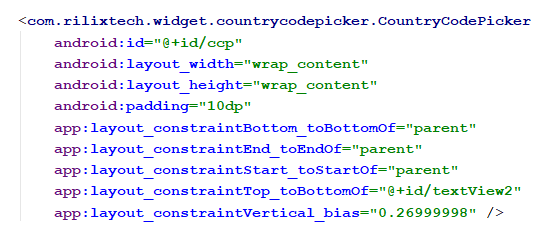

when we clicked to select our country code, a new screen comes out with country name

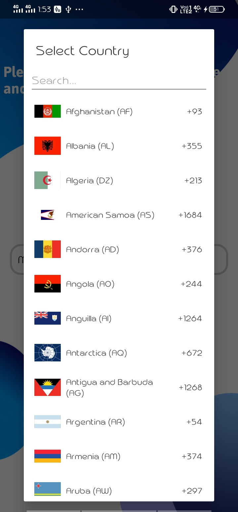

after entering the country code and phone number, it will directly go to the firebase which will verify the number with country code then a 6-digits OTP will send to the registered phone number. When we entered that OTP then server checked the OTP and verified it.

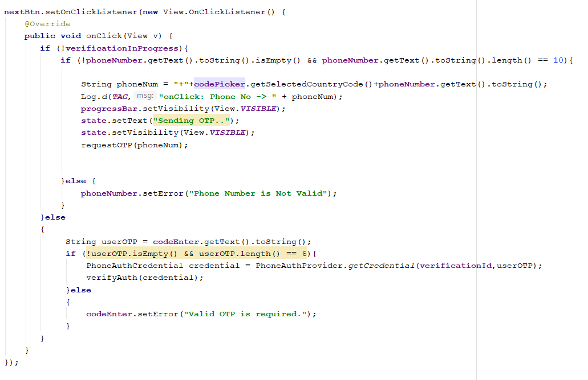

It will also create a database in `Firebase Cloud Firestore` named `users`, where details of the users are stored.

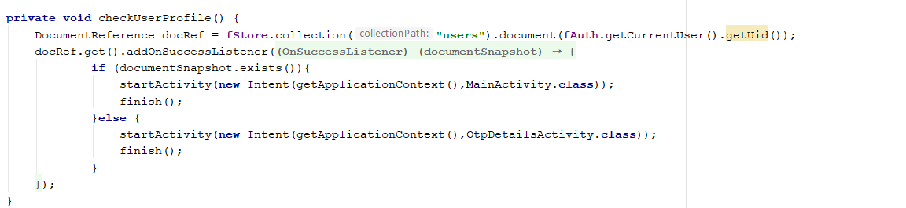     

## Showing News using news api and retrofit

From `newsapi` org using `retrofit` we call the news to our app 

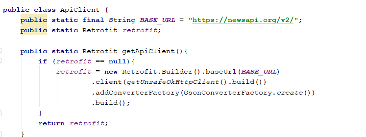

then using `API_KEY` we load the `JSON` data in our recyclerview to display the news

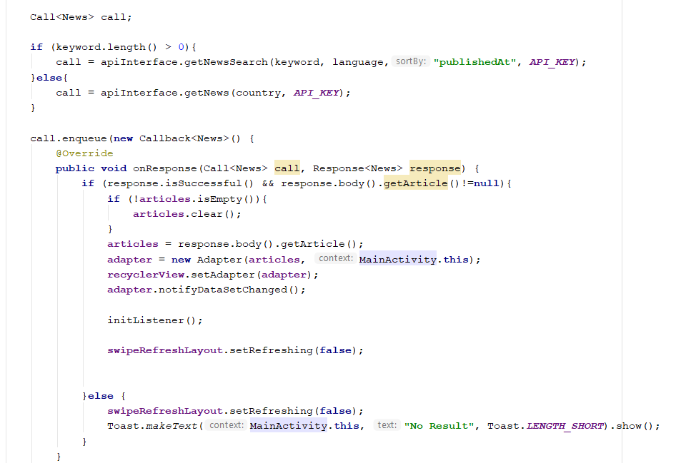

# Screenshots

   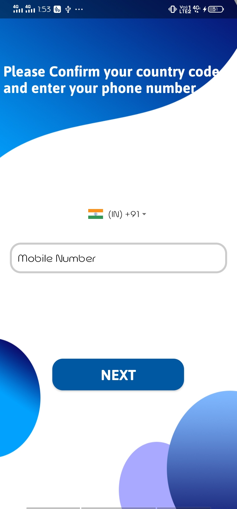 

   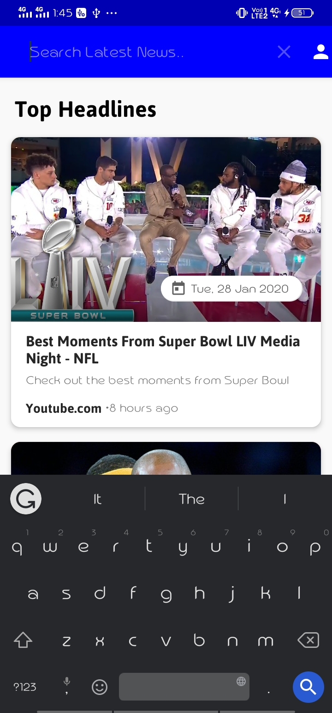 

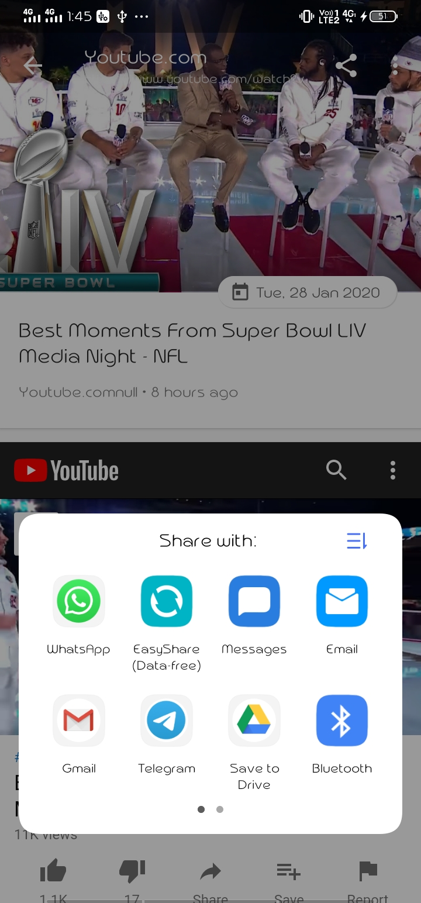  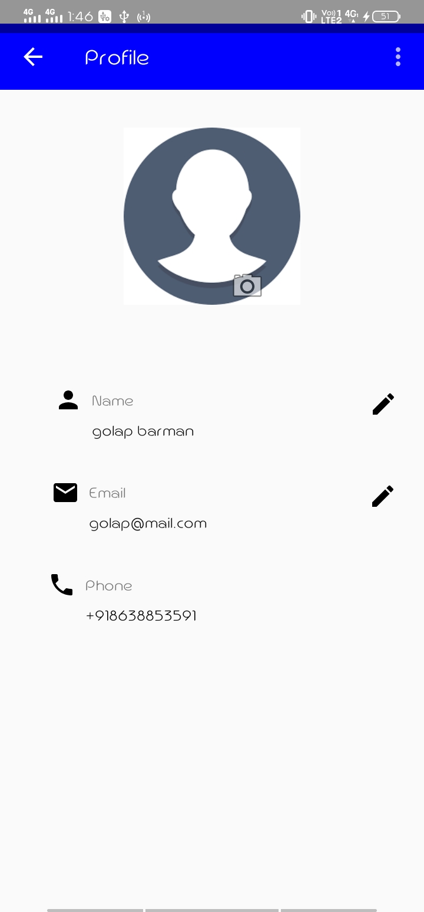   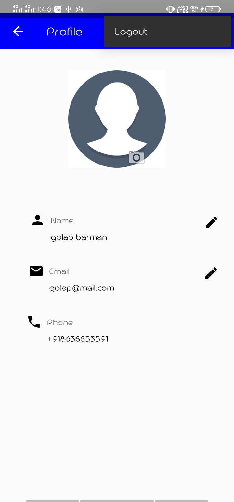

